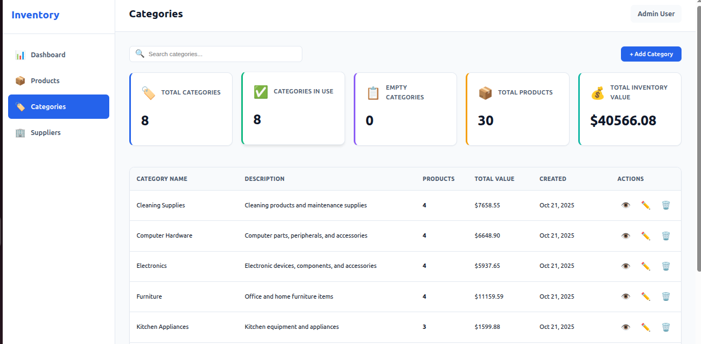
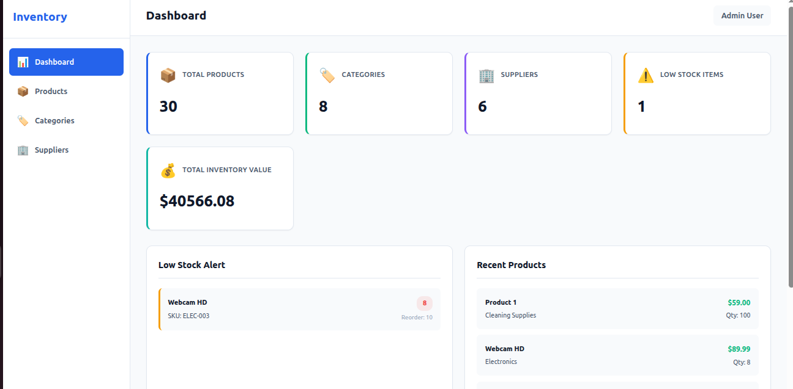
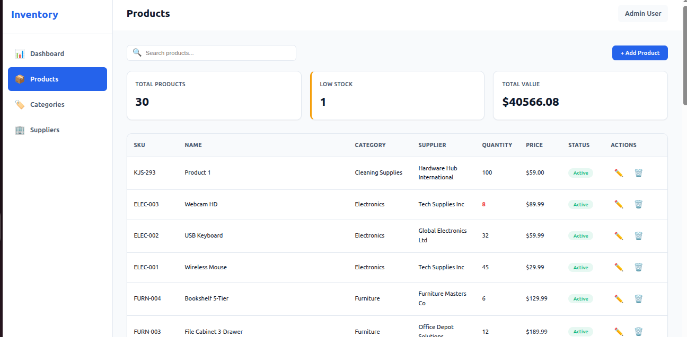
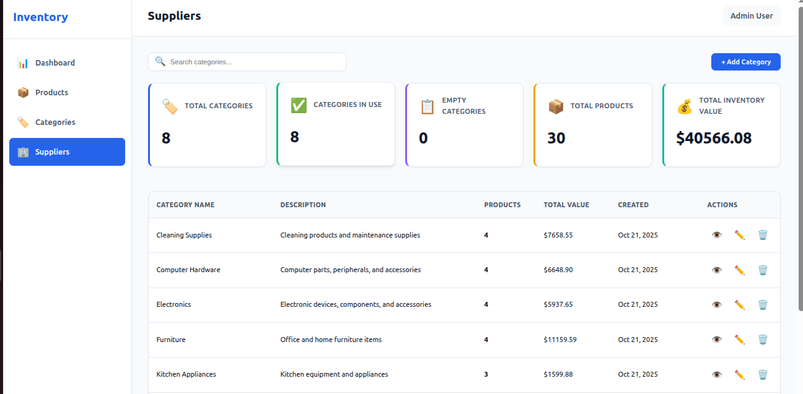

# Inventory-Application

#### A modern, full-stack inventory management application built with React, Express, and PostgreSQL. Manage products, categories, and suppliers with an intuitive interface and real-time statistics.



🔗 **[Live Demo](https://inventory-application-production-34b0.up.railway.app/)**

---

## ✨ Features

- **Product Management** - Complete CRUD operations with SKU tracking and low stock alerts
- **Category Organization** - Group products and view category-level statistics
- **Supplier Tracking** - Manage supplier contacts and view supplied products
- **Real-time Dashboard** - Monitor inventory status, low stock items, and key metrics
- **Search & Filter** - Quickly find products across all pages
- **Responsive Design** - Works seamlessly on desktop, tablet, and mobile

## 🚀 Quick Start

```bash
# Clone the repository
git clone https://github.com/anwangari/Inventory-Application.git
cd Inventory-Application

# Setup backend
cd server
npm install
touch .env
# Edit .env with your database credentials
npm run db:populate

# Setup frontend (new terminal)
cd client
npm install
touch .env # Environment variables

# Start development servers
npm run dev  # In both server/ and client/ directories
```

Visit `http://localhost:3000` to access the application.

## 🛠️ Tech Stack

**Frontend:**
- React 18 with Vite
- React Router for navigation
- Vanilla CSS for styling

**Backend:**
- Node.js with Express
- PostgreSQL database
- MVC architecture

## 📊 Database Schema

- **Products** - name, SKU, quantity, price, reorder level
- **Categories** - name, description
- **Suppliers** - name, contact info, address

## 🔌 API Endpoints

| Method | Endpoint | Description |
|--------|----------|-------------|
| GET | `/api/products` | Get all products |
| GET | `/api/products/low-stock` | Get low stock items |
| POST | `/api/products` | Create new product |
| PUT | `/api/products/:id` | Update product |
| DELETE | `/api/products/:id` | Delete product |
| GET | `/api/categories` | Get all categories |
| GET | `/api/suppliers` | Get all suppliers |


## 📱 Screenshots

### Dashboard


### Products Management


### Suppliers Page


## 🔜 Next Steps

### Planned Features

- [ ] **User Authentication**
  - JWT-based auth system
  - Role-based access control (Admin, Manager, Viewer)
  - User management dashboard
  - Secure login/logout flow

- [ ] **PDF Export**
  - Download low stock items report from dashboard
  - Generate inventory reports by category
  - Export supplier product lists
  - Scheduled report generation

- [ ] **Enhanced Features**
  - Barcode scanning for products
  - Product images/photos
  - Inventory transaction history
  - Email notifications for low stock
  - Multi-warehouse support
  - Advanced analytics and charts

## 🤝 Contributing

Contributions are welcome! Please feel free to submit a Pull Request.

1. Fork the project
2. Create your feature branch (`git checkout -b feature/AmazingFeature`)
3. Commit your changes (`git commit -m 'Add some AmazingFeature'`)
4. Push to the branch (`git push origin feature/AmazingFeature`)
5. Open a Pull Request

## 📄 License

This project is licensed under the MIT License - see the [LICENSE](LICENSE) file for details.

## 👨‍💻 Author

**Your Name**
- GitHub: [@anwangari](https://github.com/anwangari)

## 🙏 Acknowledgments

- Built with ❤️ using React and Express
- Built as part of [The Odin Project](https://www.theodinproject.com/) curriculum.

---

⭐ Star this repo if you find it helpful!